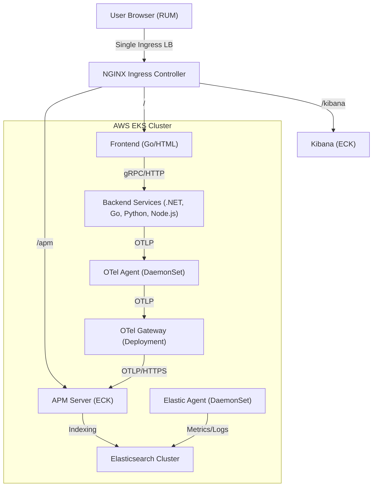

# Microservices Observability on AWS EKS: Professional Implementation (Consolidated)

This repository contains a full, "Excellent" tier implementation of an observability pipeline for the **Google Online Boutique** microservices running on **Amazon EKS**, consolidated under a single ingress point.

---

## 🏛️ 1. Application Overview: The Google Online Boutique
The **Google Online Boutique** is a cloud-native, polyglot application consisting of 12 microservices. These services work together to simulate a production e-commerce platform:

| Service | Language | Description |
| :--- | :--- | :--- |
| **Frontend** | Go | The web UI that handles user requests and renders the store. |
| **CartService** | .NET | Managed shopping carts using Redis. |
| **PaymentService** | Node.js | Processes payments (mocked) and emits tracing. |
| **ProductCatalog** | Go | Provides product information from a JSON database. |
| **CurrencyService** | Node.js | Handles real-time currency conversion. |
| **ShippingService** | Go | Calculates shipping costs and tracks shipments. |
| **CheckoutService** | Go | Coordinates the final checkout process. |
| **AdService** | Java | Serves advertisements to the frontend. |
| **EmailService** | Python | Sends order confirmation emails (mocked). |
| **Recommendation** | Python | Provides product recommendations. |
| **Redis** | C++ | Low-latency data store for cart persists. |
| **LoadGenerator** | Python | Simulates user traffic to generate traces. |

---

## 📊 2. The Monitoring Stack: Three Pillars of Observability

We've implemented a robust, **OpenTelemetry-native** pipeline that feeds into the **Elastic Stack**. 

### **Pillar 1: Distributed Tracing (APM)**
- **Tier 1 (Agent):** `otel-agent` (DaemonSet) runs on every node. It enriches spans with local K8s metadata and forwards them to the Gateway.
- **Tier 2 (Gateway):** `otel-gateway` (Deployment) handles **Tail-Based Sampling** (100% Error capture / 10% Probabilistic capture), protecting your storage from being flooded by "healthy" traffic while never missing a bug.
- **Backend:** **Elastic APM Server (ECK)** receives OTLP data and indexes it into Elasticsearch.

### **Pillar 2: Real User Monitoring (RUM)**
- **User Experience:** The **Elastic RUM Agent** is injected into the HTML of the `frontend` using a **Kubernetes ConfigMap override**. 
- **Business Value:** It captures **Core Web Vitals** (LCP, FID, CLS) and correlates browser sessions with backend server traces, providing a complete "User-to-Database" journey.

### **Pillar 3: Infrastructure Monitoring**
- **Elastic Agent:** Deployed as a standalone DaemonSet. It provides deep visibility into:
    - **Kubernetes Cluster**: Node health, CPU/Mem usage, and pod status.
    - **Service Metrics**: Redis performance and NGINX metrics.
    - **Logs**: Centralized log collection with automated metadata enrichment.

---

## 🏛️ 3. Access URLs (One LoadBalancer for Everything)
By implementing an **NGINX Ingress Controller**, we've consolidated all services into a single, cost-effective entry point.

| Target | URL | Port |
| :--- | :--- | :--- |
| **🛒 Storefront** | [http://a4e911deda0e041e5b2cd2207d686a8f-661329308.us-east-1.elb.amazonaws.com](http://a4e911deda0e041e5b2cd2207d686a8f-661329308.us-east-1.elb.amazonaws.com) | 80 |
| **📊 Kibana Dashboards** | [http://a4e911deda0e041e5b2cd2207d686a8f-661329308.us-east-1.elb.amazonaws.com/kibana](http://a4e911deda0e041e5b2cd2207d686a8f-661329308.us-east-1.elb.amazonaws.com/kibana) | 80 |
| **📡 APM Server (RUM)** | [http://a4e911deda0e041e5b2cd2207d686a8f-661329308.us-east-1.elb.amazonaws.com/apm](http://a4e911deda0e041e5b2cd2207d686a8f-661329308.us-east-1.elb.amazonaws.com/apm) | 80 |

---

## 🏛️ 4. Detailed Architecture & Data Flow

---

## 💻 5. Deployment Instructions

### **1. Infrastructure & Elastic Stack**
- **Cluster**: `eksctl create cluster -f infrastructure/eks-cluster.yaml`
- **ECK Operator**: `kubectl apply -f https://download.elastic.co/downloads/eck/2.11.1/operator.yaml`
- **Elastic Stack**: `kubectl apply -f elastic-stack.yaml`

### **2. Ingress & Telemetry Pipeline**
- **Ingress Controller**: `kubectl apply -f https://raw.githubusercontent.com/kubernetes/ingress-nginx/controller-v1.8.2/deploy/static/provider/cloud/deploy.yaml`
- **OTel Agent**: `helm upgrade --install otel-agent open-telemetry/opentelemetry-collector -f otel-collector/values-agent.yaml`
- **OTel Gateway**: `helm upgrade --install otel-gateway open-telemetry/opentelemetry-collector -f otel-collector/values-gateway.yaml`

### **3. Application & RUM Patching**
- **Instrumentation**: `kubectl apply -f infrastructure/patch-frontend-otel.yaml`
- **Frontend Ingress**: `kubectl apply -f infrastructure/frontend-ingress.yaml`

---

## 🔍 6. Section 3: Infrastructure Monitoring - How to Test
- **Inventory & Hosts**: Go to **Observability → Infrastructure → Inventory** to see the EKS nodes.
- **Database Metrics**: Search for **"Redis Overview"** in the Dashboards.
- **Network flows**: Search for `event.dataset: "packetbeat.flow"` in Discover.
- **Ingress Metrics**: Search for **"[Metrics Nginx] Overview"** in Dashboards.
